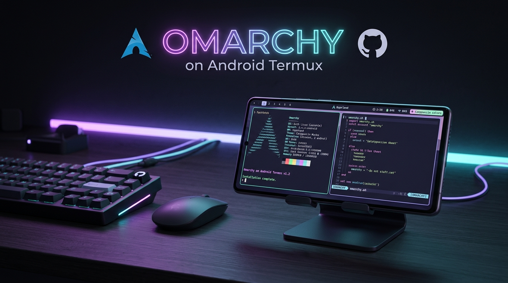
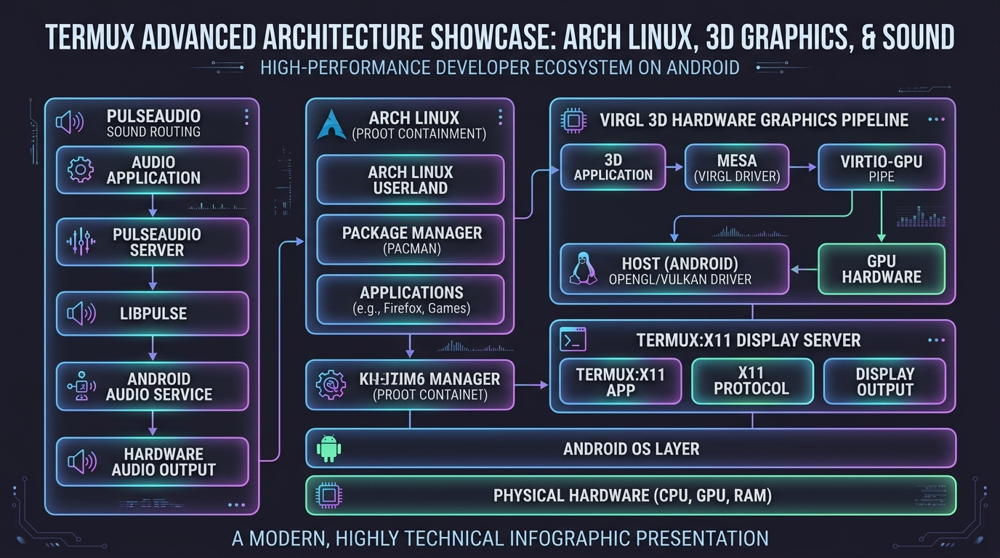

<div align="center">



# ⚡ OMARCHY ON ANDROID TERMUX

### *The Opinionated, Modern Linux Workstation in Your Pocket*

[](https://archlinuxarm.org/)
[](https://termux.dev/)
[](https://github.com/termux/proot-distro)
[](https://mesa3d.org/)
[](LICENSE)

<p align="center">
  A seamless, resilient <b>one-shot bootstrap installer</b> that transforms your Android device into a complete, hardware-accelerated developer desktop powered by <b>Arch Linux ARM</b>, <b>i3 tiling window manager</b>, <b>PulseAudio</b>, and <b>DHH’s Omarchy</b> toolchain.
</p>

[Quick Start](#-one-shot-installation) • [Prerequisites](#-prerequisites--fresh-start-guide) • [Architecture](#-system-architecture) • [Keybindings](#-desktop-shortcuts) • [Troubleshooting](#-troubleshooting--faq)

---

</div>

## 🌟 Highlights

<table>
  <tr>
    <td width="50%">
      <h3>⚡ Bulletproof One-Shot Bootstrap</h3>
      <p>Automated setup with non-interactive package handling, automatic DNS resolver injection, pacman keyring repair, and background wake-lock protection.</p>
    </td>
    <td width="50%">
      <h3>🚀 3D GPU Hardware Acceleration</h3>
      <p>High-frame-rate rendering powered by <code>virglrenderer-android</code> and Mesa Gallium Virpipe over socket-piped VirGL.</p>
    </td>
  </tr>
  <tr>
    <td width="50%">
      <h3>🔊 Native Audio Routing</h3>
      <p>Low-latency PulseAudio server streaming crystal-clear audio from Arch PRoot applications directly to Android speakers and headphones.</p>
    </td>
    <td width="50%">
      <h3>🎨 Modern Developer Ergonomics</h3>
      <p>Pre-configured with JetBrains Mono Nerd Fonts, Catppuccin colorways, i3-wm tiling, Rofi app launcher, Dunst notifications, Fastfetch, Eza, Neovim, and Tmux.</p>
    </td>
  </tr>
</table>

---

## 🏗️ System Architecture

<div align="center">
  
</div>

Omarchy on Termux uses an isolated rootless architecture to run genuine Arch Linux alongside Android without rooting your device:

1. **Android Host Layer**: Native Android kernel providing display canvas via Termux:X11 and hardware audio channels via PulseAudio TCP socket.
2. **Termux Userland**: Hosts the PRoot translation layer and VirGL hardware graphics server.
3. **Arch Linux ARM PRoot**: Full-fledged Arch Linux container with pacman package management, custom `omarchy` user, and developer utilities.
4. **Omarchy Shell & Tiling Core**: Opinionated scripts, fast aliases, Catppuccin-themed i3 session, and application menus.

---

## 📋 Prerequisites & Fresh Start Guide

If you are deleting Termux and starting fresh, follow this exact sequence:

### 1. Install Android Apps
* **Termux**: Install from [F-Droid](https://f-droid.org/en/packages/com.termux/) or [Droid-ify](https://github.com/Droid-ify/client).  
  > ⚠️ **DO NOT USE Google Play Store**: The Play Store build has been unmaintained since 2020 and will fail due to obsolete repository mirrors.
* **Termux:X11 Companion**: Download `app-arm64-v8a-debug.apk` directly from [Termux:X11 GitHub Releases](https://github.com/termux/termux-x11/releases).

### 2. Android 12+ Battery Optimization (Crucial)
Android’s "Phantom Process Killer" will terminate compiler and PRoot processes if battery optimizations are active:
1. Open **Android Settings** > **Apps** > **Termux** > **App Battery Usage** > Select **Unrestricted**.
2. Do the same for **Termux:X11** > Select **Unrestricted**.

### 3. Open Termux & Acquire Wake-Lock
On first launch, prevent Android from sleeping the network:
```bash
termux-wake-lock
```

---

## 🚀 One-Shot Installation

Copy and paste this single command into Termux:

```bash
pkg update -y && curl -sL https://raw.githubusercontent.com/NaustudentX18/omarchy-termux/main/install.sh | bash
```

<details>
<summary><b>🔍 What happens under the hood? (Click to expand)</b></summary>

1. **Environment Detection**: Detects CPU architecture (`aarch64` / `x86_64`) and engages `termux-wake-lock`.
2. **Host Provisioning**: Enables `x11-repo` and non-interactively installs `proot-distro`, `virglrenderer-android`, `termux-x11-nightly`, and `pulseaudio`.
3. **Arch Rootfs Bootstrap**: Deploys Arch Linux ARM rootfs and injects Cloudflare (`1.1.1.1`) and Google (`8.8.8.8`) DNS to prevent network resolution drops.
4. **Pacman Keyring Auto-Repair**: Resets corrupted GPG databases, initializes `pacman-key`, and imports `archlinuxarm-keyring`.
5. **Desktop & Fonts Setup**: Installs JetBrains Mono Nerd Font, Cascadia Code, Noto Fonts, i3, Rofi, Picom, Fastfetch, Neovim, and Zsh.
6. **Omarchy Core Integration**: Clones `omacom/omarchy` toolkit, configures user profiles, and links commands.
7. **Launch Script Generation**: Writes `omarchy-gui` and `omarchy-cli` commands with automated cleanup.
</details>

---

## 🎮 Launching Omarchy

### Option A: Graphical Desktop (Termux:X11)
To start the full graphical environment:

```bash
omarchy-gui
```
> **Next Step:** Switch to the **Termux:X11** app. Your desktop with statusbar, terminal, and wallpaper will be active!

### Option B: Terminal-Only Mode
If you only need a blazing-fast CLI session inside Arch Linux ARM without launching X11:

```bash
omarchy-cli
```

---

## ⌨️ Desktop Shortcuts

| Shortcut | Action | Description |
|:---|:---|:---|
| <kbd>Super</kbd> + <kbd>Return</kbd> | **Open Terminal** | Spawns clean accelerated terminal window |
| <kbd>Super</kbd> + <kbd>d</kbd> | **Application Launcher** | Opens Rofi fuzzy app search menu |
| <kbd>Super</kbd> + <kbd>q</kbd> | **Close Window** | Closes currently focused window |
| <kbd>Super</kbd> + <kbd>f</kbd> | **Toggle Fullscreen** | Expands window to fill phone screen |
| <kbd>Super</kbd> + <kbd>Shift</kbd> + <kbd>Space</kbd> | **Toggle Floating** | Switches between tiled and floating mode |
| <kbd>Super</kbd> + <kbd>Shift</kbd> + <kbd>r</kbd> | **Restart i3** | Reloads window manager configuration |
| <kbd>Super</kbd> + <kbd>Shift</kbd> + <kbd>e</kbd> | **Exit Session** | Gracefully closes graphical desktop |

*Tip: In Termux:X11 preferences, you can map the `Super` key to `Volume Up`, `Volume Down`, or on-screen touch controls.*

---

## 🛠️ Troubleshooting & FAQ

<details>
<summary><b>Q: Pacman gives "Temporary failure in name resolution" inside Arch</b></summary>
Run this command in Termux to reset the DNS resolver inside the rootfs:
```bash
echo "nameserver 1.1.1.1" | proot-distro login archlinux -- tee /etc/resolv.conf
```
</details>

<details>
<summary><b>Q: How do I adjust resolution or scaling on a high-DPI phone?</b></summary>
Open the Termux:X11 app, swipe in from the left edge (or pull down notification shade), open <b>Preferences</b>:
- Set <b>Display Resolution Mode</b> to <i>Scaled</i> or adjust zoom to <b>100% – 125%</b>.
- Switch between <b>Trackpad (Mouse)</b> or <b>Direct Touch</b> mode.
</details>

<details>
<summary><b>Q: Sound is not playing from Linux apps</b></summary>
Restart the host sound server in Termux:
```bash
pulseaudio --kill && pulseaudio --start --load="module-native-protocol-tcp auth-ip-acl=127.0.0.1 auth-anonymous=1" --exit-idle-time=-1
```
</details>

---

## 📜 Credits & Acknowledgements

- **[Omarchy](https://github.com/omacom/omarchy)** by David Heinemeier Hansson (DHH) & Omacom Foundation.
- **[Termux](https://termux.dev/)** & **[Termux:X11](https://github.com/termux/termux-x11)** for the foundational Android Linux infrastructure.
- **[Arch Linux ARM](https://archlinuxarm.org/)** for the rolling-release ARM rootfs.

---

<div align="center">
  <sub>Crafted for modern Linux productivity on mobile hardware. Contributions and feedback are welcome!</sub>
</div>
